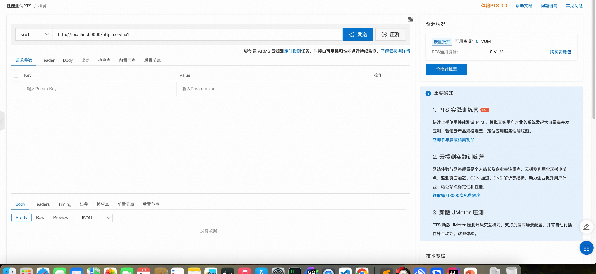

# Benchmark Usage
## How to run it?
### 1. build agent
Go to the root directory of `opentelemetry-go-auto-instrumentation` and execute the following command:
```shell
make clean && make build
```
And there will be a `otelbuild` binary in the project root directory.
### 2. run mysql & redis
We recommend you to use k8s to run mysql and redis:
```shell
kubectl apply -f mysql-redis.yaml
```
Also you can run mysql and redis use docker.
```shell
docker run -d -p 3306:3306 -p 33060:33060 -e MYSQL_USER=test -e MYSQL_PASSWORD=test -e MYSQL_DATABASE=test -e MYSQL_ALLOW_EMPTY_PASSWORD=yes mysql:8.0.36
docker run -d -p 6379:6379 redis:latest
```

### 3. do hybrid compilation
Change directory to `example/benchmark` and execute the following command:
```shell
cd example/benchmark
../../otelbuild
```
And there will be a `benchmark` binary in the `example/benchmark` directory.
### 4. if run on k8s, build app images
```shell
docker build -t benchmark:test .
docker push benchmark
```
you can run application use our docker image.
```shell
registry.cn-hangzhou.aliyuncs.com/private-mesh/hellob:benchmark
```
### 5. run jaeger
if you run on k8s
```shell
kubectl apply -f jaeger.yaml
```
if you run on loacal machine:
```shell
docker run --rm --name jaeger \
  -e COLLECTOR_ZIPKIN_HOST_PORT=:9411 \
  -p 6831:6831/udp \
  -p 6832:6832/udp \
  -p 5778:5778 \
  -p 16686:16686 \
  -p 4317:4317 \
  -p 4318:4318 \
  -p 14250:14250 \
  -p 14268:14268 \
  -p 14269:14269 \
  -p 9411:9411 \
  registry.cn-hangzhou.aliyuncs.com/private-mesh/hellob:jaeger
```
### 6. run application
Set your opentelemetry endpoint according to https://opentelemetry.io/docs/specs/otel/configuration/sdk-environment-variables

if run on loacal machine:
```shell
OTEL_EXPORTER_ENDPOINT="localhost:4318" OTEL_EXPORTER_INSECURE=true OTEL_SERVICE_NAME=benchmark ./benchmark
```
if run on k8s, update the `benchmark.yaml` image:
```shell
kubectl apply -f benchmark.yaml
```
And request to the server:
```shell
curl localhost:9000/http-service1
```
Wait a little while, you can see the corresponding trace data！All the spans are aggregated in one trace.

## How to generate benchmark report?
you can use aliyun pts to generate benchmark report.

get the pts report:


## Related
You can report your span to [xTrace](https://help.aliyun.com/zh/opentelemetry/?spm=a2c4g.750001.J_XmGx2FZCDAeIy2ZCWL7sW.10.15152842aYbIq9&scm=20140722.S_help@@%E6%96%87%E6%A1%A3@@90275.S_BB2@bl+RQW@ag0+BB1@ag0+hot+os0.ID_90275-RL_xtrace-LOC_suggest~UND~product~UND~doc-OR_ser-V_3-P0_0) in Alibaba Cloud. xTrace provides out-of-the-box trace explorer for you!
