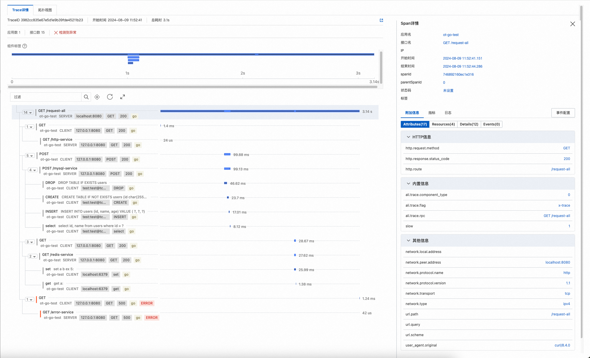

# Benchmark Usage
## How to run it?
### 1. build agent
Go to the root directory of `opentelemetry-go-auto-instrumentation` and execute the following command:
```shell
make clean && make build
```
And there will be a `otelbuild` binary in the project root directory.
### 2. run mysql & redis
We recommend you to use k8s to run mysql and redis:
```shell
kubectl apply -f mysql-redis.yaml
```
Also you can run mysql and redis use docker.
```shell
docker run -d -p 3306:3306 -p 33060:33060 -e MYSQL_USER=test -e MYSQL_PASSWORD=test -e MYSQL_DATABASE=test -e MYSQL_ALLOW_EMPTY_PASSWORD=yes mysql:8.0.36
docker run -d -p 6379:6379 redis:latest
```

### 3. do hybrid compilation
Change directory to `example/benchmark` and execute the following command:
```shell
cd example/benchmark
../../otelbuild
```
And there will be a `benchmark` binary in the `example/benchmark` directory.
### 4. if run on k8s, build app images
```shell
docker build -t benchmark:test .
docker push benchmark
```
### 5. run application on k8s
Set your opentelemetry endpoint according to https://opentelemetry.io/docs/specs/otel/configuration/sdk-environment-variables
```shell
kubectl apply -f benchmark.yaml
```
if run on loacal machine:
```shell
./benchmark
```
if run on k8s, update the `benchmark.yaml` image:
```shell
kubectl apply -f benchmark.yaml
```
And request to the server:
```shell
curl localhost:9000/http-service1
```
Wait a little while, you can see the corresponding trace data！All the spans are aggregated in one trace.

## How to generate benchmark report?
TODO @NameHaibinZhang
## Related
You can report your span to [xTrace](https://help.aliyun.com/zh/opentelemetry/?spm=a2c4g.750001.J_XmGx2FZCDAeIy2ZCWL7sW.10.15152842aYbIq9&scm=20140722.S_help@@%E6%96%87%E6%A1%A3@@90275.S_BB2@bl+RQW@ag0+BB1@ag0+hot+os0.ID_90275-RL_xtrace-LOC_suggest~UND~product~UND~doc-OR_ser-V_3-P0_0) in Alibaba Cloud. xTrace provides out-of-the-box trace explorer for you!
