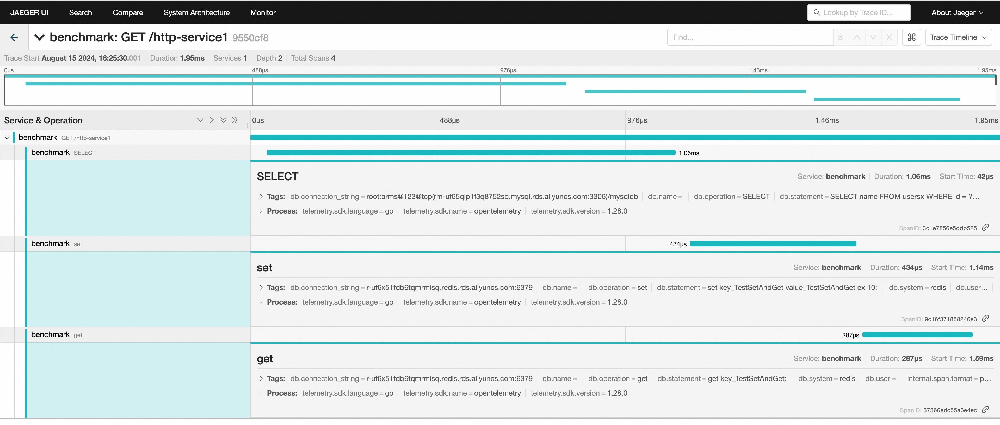

# Demo Usage

## How to run it?

### 1. build agent

Go to the root directory of `loongsuite-go-agent` and execute the following command:

```shell
make clean && make build
```

And there will be a `otel` binary in the project root directory.

### 2. run mysql & redis

We recommend you to use k8s to run mysql and redis:

```shell
kubectl apply -f mysql-redis.yaml
```

Also you can run mysql and redis use docker.

```shell
docker run -d -p 3306:3306 -p 33060:33060 -e MYSQL_USER=test -e MYSQL_PASSWORD=test -e MYSQL_DATABASE=test -e MYSQL_ALLOW_EMPTY_PASSWORD=yes mysql:8.0.36
docker run -d -p 6379:6379 redis:latest
```

### 3. do hybrid compilation

First, please make sure your `go` version is [compatible](../../docs/compatibility.md) with otel.

Change directory to `example/demo` and execute the following command:

```shell
cd example/demo
../../otel go build
```

And there will be a `demo` binary in the `example/demo` directory.

### 4. if run on k8s, build app images

```shell
docker build -t demo:test .
docker push demo
```

You can also run application using our docker image:

```shell
registry.cn-hangzhou.aliyuncs.com/private-mesh/hellob:demo
```

### 5. run jaeger

If you run on k8s

```shell
kubectl apply -f jaeger.yaml
```

If you run on loacal machine:

```shell
docker run --rm --name jaeger \
  -e COLLECTOR_ZIPKIN_HOST_PORT=:9411 \
  -p 6831:6831/udp \
  -p 6832:6832/udp \
  -p 5778:5778 \
  -p 16686:16686 \
  -p 4317:4317 \
  -p 4318:4318 \
  -p 14250:14250 \
  -p 14268:14268 \
  -p 14269:14269 \
  -p 9411:9411 \
  jaegertracing/all-in-one:1.53.0
```

### 6. run application

Set your OpenTelemetry endpoint according
to https://opentelemetry.io/docs/specs/otel/configuration/sdk-environment-variables

if run on local machine:

```shell
OTEL_EXPORTER_OTLP_ENDPOINT="http://127.0.0.1:4318" OTEL_EXPORTER_OTLP_INSECURE=true OTEL_SERVICE_NAME=demo ./demo
```

if run on k8s, apply the `demo.yaml`:

```shell
kubectl apply -f demo.yaml
```

and you can configure the following environment variables when you run the application on k8s:

| Environment Name | Meaning                                      | Example                            |
|------------------|----------------------------------------------|------------------------------------|
| REDIS_ADDR       | The address of the Redis service             | redis-svc:6379                     |
| REDIS_PASSWORD   | The password of the Redis service            | Hello1234                          |
| MYSQL_DSN        | The full connection string of MySQL database | test:test@tcp(127.0.0.1:3306)/test |

And request to the server:

```shell
# or you can request your real service address if you run it on k8s
curl localhost:9000/http-service
```

### 7. check trace data

if run on local machine:

access Jaeger UI: http://localhost:16686

if run on k8s, run the command to get access endpoint of Jaeger UI:

```shell
kubectl get svc opentelemetry-demo-jaeger-collector
```

Wait a little while, you can see the corresponding trace data！All the spans are aggregated in one trace.


### 8. check prometheus data

if run on local machine:

access prometheus page: http://localhost:9464/metrics


## Related

You can report your span
to [xTrace](https://help.aliyun.com/zh/opentelemetry/?spm=a2c4g.750001.J_XmGx2FZCDAeIy2ZCWL7sW.10.15152842aYbIq9&scm=20140722.S_help@@%E6%96%87%E6%A1%A3@@90275.S_BB2@bl+RQW@ag0+BB1@ag0+hot+os0.ID_90275-RL_xtrace-LOC_suggest~UND~product~UND~doc-OR_ser-V_3-P0_0)
in Alibaba Cloud. xTrace provides out-of-the-box trace explorer for you!
